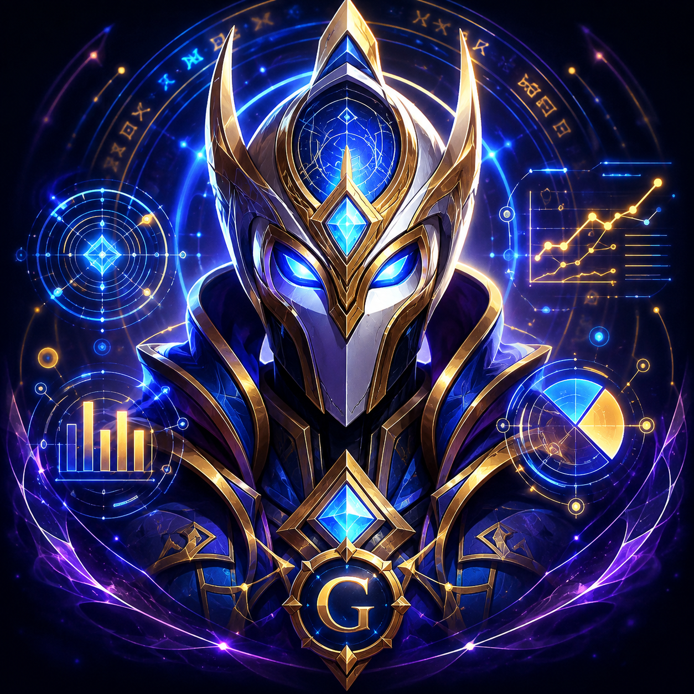

# GideonRaid



*The guild's raid coach, and the GIDEON orchestrator — World of Warcraft: Midnight (12.1).*

Guild addon (World of Warcraft: Midnight, `## Interface: 120100`) that helps with
the mechanic of **pairing players carrying complementary debuffs** during a raid
intermission, with the **GIDEON** Discord bot as the assignment source, and that
embeds a second module: the **Intermission Coach** for the *Entombed Sentinels*
boss (mythic) — see [`docs/INTERMISSION-COACH.md`](docs/INTERMISSION-COACH.md).

---

## 1. Why the architecture is "weird" (and why it is mandatory)

In 12.x, an addon **can no longer** do what a raid addon used to do:

| Before 12.0 | Since 12.0 |
|---|---|
| Read other players' auras (`UnitAura`) and decide | The value may be **secret**: `if aura > 0` = **immediate Lua error** |
| Listen to `COMBAT_LOG_EVENT` | **Registering the event raises an error** |
| Exchange addon→addon messages in an instance | **No channel any more** |
| Work around the restrictions | Forbidden by Blizzard, breaks on every patch |

So the pairing **cannot** be computed in the client during combat. It is computed
**out of game by GIDEON**, written into the SavedVariables, and the addon only
**reads and displays** it:

```
GIDEON (VPS, out of game)
  Discord roster  →  lua5.1 tools/pairing_cli.lua  →  pairs
                                |
                                v
  WTF/Account/<ACCOUNT>/SavedVariables/GideonRaid.lua   (strings, never secret)
                                |
                          player /reload
                                v
                     GideonRaid displays the pairs
```

Sources: [Secret Values](https://warcraft.wiki.gg/wiki/Secret_Values) ·
[API changes 12.0.0](https://warcraft.wiki.gg/wiki/Patch_12.0.0/API_changes) ·
[Patch 12.1.0](https://warcraft.wiki.gg/wiki/Patch_12.1.0).

---

## 2. The pairing engine is shared

`Core/Pairing.lua` is **pure Lua 5.1**: the very same file runs inside the WoW
client and on the VPS. That is what guarantees that GIDEON and the addon always
compute *exactly* the same thing.

```bash
$ lua5.1 tools/pairing_cli.lua < tools/sample_roster.csv
Bren|Aster
Coren|Bathman
Ilya|Dorian
Kaela|Halda
Mira|Lumen
Rukh|Nyx
Serka|Ordan
Sylvia|Pax
Velna|Torgh
Zerun|Vaelen
```

**Deterministic** result (alphabetical sort): the same roster always gives the
same result, so it can be compared with `diff`.

---

## 3. Intermission Coach — *Entombed Sentinels* (mythic)

During that intermission every player sees a **number** above their head, but
**the number does not determine the colors**: only "**2**" is unambiguous
(always 2 green + 2 red); "**1**" and "**3**" can be either 3 green + 1 red, or
1 green + 3 red — it is the **color of the orbs** that decides. There are
therefore only **three real states** (`3V1R`, `2V2R`, `1V3R`) and the survival
rule is a **color addition**: the sum of the two players must make
**4 green + 4 red** (`3V1R+1V3R` or `2V2R+2V2R`). Any other combination kills;
`3V1R + 2V2R` = **5 green** = the "5g". After **3 s** the room goes dark:
everyone then sees only their own orbs.

The addon can read **neither the other players' indicators nor its own** (secret
values) and **cannot send a ping** — measured in game: `C_Ping.SendMacroPing`
is refused by the client ("this action can only be used by the Blizzard UI"),
from a macro as well as from an addon. The module therefore does what is still
possible:

| Screen | Content | Data source |
|---|---|---|
| Main panel (`/gr`) | partner, role, position, pairs, then the buttons **in this order**: **PLACE INTERMISSION PANEL** -> **SIM: PING YOURSELF** -> **SIM: INTERMISSION GROUP** -> the LOCK/UNLOCK utility (frozen by a test: an evening flow, then a separated utility); the panel is **draggable** and reopens where you left it, and its frame is **as wide as its longest label in both languages** | `assignment` block prepared out of game by GIDEON |
| Placement mode (before the pull) | the panel shows **ONE thing only**: the Gideon illustration (`Texture/placement.tga`), so you can see the size and the spot the window will take; it is **dragged** where you want it and **`/gr inter ok`** saves the position and closes — the panel carries **no button at all**; the close cross (`X`) cancels instead of validating | the player's drag (persisted) |
| Intermission panel (opens by itself 2 s before the intermission — **only on the delivered/configured target boss** (`/gr boss`, delivered id `3445` = *Entombed Sentinels*, every difficulty) — or `/gr inter`) | **three vertically stacked cards** carrying the raid lead's screenshots of the three compositions (`3V1R` / `2V2R` / `1V3R`, order frozen by `Core/Layout.lua`), each one **a thin border around its picture**, **no title and no text at all**; during a rehearsal only, the SIMULATION banner; **no sound** at that moment | the player's click |
| After the click | **ONE word, and nothing else** — `Ping` / `BOSS` / `Chasseur` (**44 px**, and **64 px** for `BOSS`, the biggest text of the window), the two survival words in green, `BOSS` in the theme colour — plus the **CORRECT** button; **the three cards disappear** (CORRECT brings them back) | `Core/Locale.lua` (`state.word.*`) + the theme in `Core/Layout.lua` |
| Ping | **which ping to use** (`PING: Warning`) and, if you bound one, **which key to press** (`PING: Warning - press Q`) — the addon **never pings** | the player's keybinds, read with `GetBindingKey` |
| Assignment sound | **one soundboard per composition**, played **once** the moment you declare yours (real flow *and* rehearsal) — and **on the click only**: the addon plays **no** sound by itself (the intermission start file is manual, `/gr sound test start`), on the Master channel; `/gr sound on\|off` mutes it, `/gr sound test 1v3r\|2v2r\|3v1r` plays one on request | `Core/Sound.lua` (pure table) + four Ogg files in `Sound/` |
| Which boss may open the panel | a **delivered default target** (encounter id `3445` = *Entombed Sentinels*, all difficulties, no command needed) plus a **persisted allow-list of encounter ids**: `/gr boss <id>`, `/gr boss list` (with provenance), `/gr boss clear` (**explicitly** drops the delivered default = nothing opens), optional name list, `/gr idlog on\|off` to read the real id in game; `/gr inter on` = manual override for the next encounter; `/gr diag` = read-only health report | pure decision in `Core/BossFilter.lua` + the delivered constants in `Core/Config.lua` + the pure report in `Core/Diag.lua` |
| Close cross (`X`, top right) | closes the panel — on **both** the main panel, the intermission panel and the ping help window | `Core/Locale.lua` (`ui.closeCross`, `ui.closeTooltip`) |
| SIMULATION mode (no boss, no raid) | **Intermission group** (`/gr sim inter`): the panel opens **RIGHT AWAY** with **its three picture cards** (`3V1R` / `2V2R` / `1V3R`, each one a thin border around the raid lead's screenshot), you click your composition, get **the one word** + CORRECT and **you close it yourself** (X) - ONE single cycle, nothing closes it and nothing relaunches it; **Ping help** (`/gr sim ping` = `/gr pinghelp`): a **short information window** (draggable, closable) telling you **how to bind one key per ping** (`Options > Keybindings > Ping`) and the operational reminder - **during the boss, when the panel says `PING: YES`, hover YOUR OWN character frame and press your key: you ping yourself** - plus the two limits: pings only show **while grouped** and **the addon cannot detect a ping** | pure logic in `Core/Simulation.lua` + the pure layout in `Core/Layout.lua` (+ the close cross and the main-panel buttons) |

The panel shows the essential only — before the click the three picture cards,
after the click ONE word and CORRECT; the explanations and the way each decision is
justified live in [`docs/INTERMISSION-COACH.md`](docs/INTERMISSION-COACH.md), never
on screen.

### 3.1 Ping roles by STATE (instead of one duty per number)

A state carries a **role**, and the role decides what the player does:

| State | Role | Does it ping? (default policy) | The ONE action line |
|---|---|---|---|
| `1V3R` | **ANCHOR** | **YES** — pings itself with the native ping keybind, or is pinged by another player | "PING: YES - hover YOUR OWN character frame (your health bar) then press your ping key (Warning): you ping yourself, stay put and jump on the spot" |
| `2V2R` | **MIDDLE** | no | "DO NOT PING - go to the middle / under the boss" |
| `3V1R` | **CHASER** | no | "DO NOT PING - run to a ping (a 1V3R)" |

**Why the ANCHOR line names the mouse gesture — CONFIRMED IN GAME.** The ping goes
where the **mouse** is: hovering **your own character frame** (the unit frame with
your health bar) and pressing the ping key **displays the ping on yourself**. The
raid lead validated the gesture in game (fifth in-game test: *"the ping on the
health bar works fine to show it on myself"*), so the action line spells it out
instead of a vague "ping yourself" and it is no longer on the "to be confirmed"
list. What is still **to be observed in a real raid**: how long that self-ping
stays visible on the other players' screens **after the room darkens**, and
whether it shows on their raid frames (see `docs/TESTPLAN.md`, row 14b).

**Why:** every state pinging used to flood the channel with ~20 pings; with one
ping per anchor (4 per side) the raid sends **at most ~8 pings**, which stays
readable — the client also rate-limits pings per player, and that limit is a
**measured fact** (3 pings in a row, then ~5 s of wait, then 3 again), not an
assumption (see `docs/TESTPLAN.md`, row 13). An ANCHOR may also simply **be
pinged by another player** of the raid: only one signal per anchor is needed, and
since patch **12.1 pings are visible on the raid frames**, so a chaser finds the
anchor without any addon-to-addon communication.

The policy is **configurable** (`/gr ping`, persisted in
`GideonRaidDB.intermission.pingMode`):

| Policy | Who pings |
|---|---|
| `anchors` (**default**, raid-lead decision) | only the `1V3R` ANCHORS |
| `color` (raidstrats variant) | every state, with its own color: `1V3R` red/Warning, `2V2R` blue/OnMyWay, `3V1R` green/Assist |
| `none` | nobody: the raid plays on positions only |

The addon **never sends a ping and no longer generates any macro** (that route is
refused by the client): it says **which ping to use** and, when it can read it,
**which key to press**. Pressing it is the player's job — Blizzard's own UI then
sends the ping. If no key is bound, the panel displays no key and points to
*Options > Keybindings > ping system*, never a shortcut that does not exist.

**Nothing is automatic.** The interface states it explicitly: *who declared what
is UNKNOWN* (no addon→addon channel in an instance, the UI is local to the
client); **the ping is the only signal visible to the other players** — and the
player is the one who places it.

### 3.2 Evening flow

1. before the pull, `/gr` → **PLACE INTERMISSION PANEL** (or `/gr inter place`):
   the panel then shows **one single thing** — the Gideon illustration — so you can
   see the **size and the spot** the window will occupy during the fight. Drag the
   panel where it must appear, prepare your ping keybind in
   *Options > Keybindings*, then **`/gr inter ok`** to save the position (the panel
   itself carries **no button at all**; the close cross **cancels**);
2. before the pull **you have nothing to configure**: the addon already targets
   *Entombed Sentinels* (encounter id `3445`, every difficulty — see §3.4). To
   target **another** boss, `/gr boss <id>` (the *encounter id*, read in game with
   `/gr idlog on`). If someone **cleared** the target on purpose (`/gr boss
   clear`), nothing opens by itself any more until an id is given again: a panel
   which does not open is better than a panel that opens on the wrong boss. `/gr
   diag` tells you where the target comes from;
3. pull the boss: `ENCOUNTER_START` starts the **pre-computed schedule**
   (46.3 s, then 148.9 / 251.5 / 353.2 s) **only when the encounter is the
   configured target**. The event arguments are read **once, under `pcall`**, and
   only to compare the encounter id (and the optional name): they drive nothing
   else, and a value that cannot be read (a *secret* value in 12.x) is never a
   match;
4. **1–2 s before each intermission the panel opens by itself** with **three
   stacked vertical cards** — one picture per orb composition instead of words
   (§3.5): each card is a **thin border around the picture**, nothing else. **The
   panel writes no title at all** and **nothing is played** at that moment: the
   window is silent;
5. click the picture that matches the four orbs above your head: the three cards
   disappear (so no accidental second click) and the panel shows **one single
   word**, **five notches bigger than before** — `PING` in green (1 green + 3 red,
   the anchor), `BOSS` (2 green + 2 red, the middle) in the **biggest font of the
   window** (64 px) or `CHASER` in green (3 green + 1 red, the chaser), both at
   44 px — plus **CORRECT**, which brings the three pictures back as many times as
   needed. The panel widens itself so that **no word is ever truncated**, in
   French as in English;
6. at the end of the intermission the panel **closes by itself** (bounded delay,
   `Config.autoCloseSeconds`, 30 s by default); the next one reopens it
   automatically.

To test the whole flow **now**, on any boss, `/gr inter on` is the **manual
override**: it arms the panel for the **next** encounter whatever the boss
(consumed at the end of that encounter). It is the only way to open the panel on
a boss that is not the configured target.

**The panels are movable** (third in-game test): the main panel used to be frozen
(`lockPanel` was hard-coded to `true`). It is now **draggable by default**, and so
is the ping help window; each one **keeps its position** (saved in
`GideonRaidDB`, restored on `/reload`). Three new commands:

```bash
/gr lock           # freeze the panels where they are (persisted)
/gr unlock         # let them be dragged again (also the UNLOCK PANEL button)
/gr resetposition  # bring the main panel, the intermission panel and the ping help window back to the center
```

An existing `SavedVariables` file (all of them carried the old `lockPanel = true`)
is **unlocked once** on the first load after the update, then your own choice is
respected.

**Close cross (`X`, top right)** — on the main panel and on the intermission
panel: it closes the panel (during the placement it **cancels**, exactly like the
Close button, and during a simulation it **leaves the rehearsal**). Hiding the
intermission panel never touches the clock: it still closes by itself at the end
and opens again at the next intermission.

**Rehearse alone — SIMULATION mode** (no boss, no raid), from the main panel
(`SIMULATION` buttons) or from the chat:

```bash
/gr sim inter   # "Intermission group": the panel opens RIGHT AWAY, click your composition,
                # correct it with REDO, then close it YOURSELF (X or Close). One single cycle.
/gr sim ping    # PING HELP (= /gr pinghelp): how to bind one key per ping, and how to ping yourself
/gr sim stop    # close the rehearsal or the help window (= the Close button, = the cross)
```

The simulation is **isolated from the real flow**: it never arms/disarms the
`ENCOUNTER_START` timeline, publishes no decision, is refused while a real
intermission runs and is stopped the moment a real encounter starts. During a
rehearsal the panel displays a two-line
`SIMULATION - NO BOSS, NO RAID` / `SINGLE REHEARSAL - YOU CLOSE THE PANEL YOURSELF`
banner so it can never be mistaken for a fight, and the headline replaces the combat
countdown (there is no boss, hence no orb to read). The ping help window states as is
that **the addon cannot detect a ping** (no API reports one), that it **never sends a
ping**, and that **pings only show while in a group or a raid**.

```bash
make inter    # convention + action lines, out of game
make plan     # pre-pull view from the contract fixture
```

### 3.3 Assignment soundboards (one sound per composition)

Requested by the raid lead: the moment you **declare** your orb composition — a
click on one of the three buttons, in the real flow **as in the `/gr sim inter`
rehearsal** — the soundboard of **that** state is played, **once**.

| State | File | Client path |
|---|---|---|
| `1V3R` | `Sound/assign-1v3r.ogg` | `Interface\AddOns\GideonRaid\Sound\assign-1v3r.ogg` |
| `2V2R` | `Sound/assign-2v2r.ogg` | `Interface\AddOns\GideonRaid\Sound\assign-2v2r.ogg` |
| `3V1R` | `Sound/assign-3v1r.ogg` | `Interface\AddOns\GideonRaid\Sound\assign-3v1r.ogg` |

#### No automatic sound: the intermission start file is manual only

**The addon never plays a sound by itself.** The raid lead's own recording (Ogg
Vorbis, stereo 44.1 kHz, 3.22 s, `Sound/intermission-start.ogg`) used to be played
at the very beginning of every intermission. It is **no longer triggered
automatically** — not at the auto-open, not in `/gr sim inter`, not when the panel
closes. **The only sound trigger left is a click on one of the three composition
pictures.** The file stays in the package so the decision can be reversed later,
and it can still be heard on demand:

```bash
/gr sound test start       # hear the (now manual-only) intermission start sound
```

```bash
/gr sound                  # is the sound enabled? (and how to change it)
/gr sound on | off         # enable/disable it (persisted; an unknown value is refused)
/gr sound test 1v3r        # hear one soundboard now, without waiting for a fight
/gr sound test 2v2r        # (also: 3v1r)
/gr sound test start       # hear the intermission start sound now
```

The file must stay listed in `GideonRaid.toc` (a sound that is not listed is not
loaded by the client, and `PlaySoundFile` then fails silently): a test checks the
entry **and** the file on disk.

Rules, all covered out of game by `tests/spec/sound_spec.lua`:

- **No sound without a declaration**: nothing is played until you click your
  composition (a state that is not `1V3R` / `2V2R` / `3V1R` is refused, nothing is
  guessed);
- **Once**: a repeated declaration of the same composition, a panel tick or a
  re-render cannot double the sound. **CORRECT** re-arms it: the next click plays
  the sound of the composition it declares, even when it is the same one. A new
  intermission (and a new rehearsal) re-arms it too;
- **Silent on failure**: a missing file, a refused call or an absent
  `PlaySoundFile` leaves the addon silent, **without a Lua error** and without
  interrupting the panel — the declaration and the rendering carry on;
- **`PlaySoundFile` is called from `UI/` only, under `pcall`, on the `Master`
  channel** (your master volume applies). `tests/spec/guard_spec.lua` fails if it
  ever appears in `Core/`, outside `UI/`, or unguarded;
- the choice of the file per state is a **pure table in `Core/Sound.lua`**
  (`Sound.FILES_BY_STATE`), testable without the client;
- the preference lives in `GideonRaidDB.intermission.soundEnabled` (`true` by
  default). It is resolved **totally**: only an exact `false` mutes the sound, so
  an older SavedVariables (no field) or a hand-edited value falls back to the
  default — the migration of the existing saves is a no-op.

#### Replacing the three sounds (when the real recordings are ready)

The three shipped files are **silent placeholders** (0.2 s of silence, Ogg
Vorbis), so nothing is broken in the meantime. Replacing them is a **file drop,
with no code change**:

> `Sound/intermission-start.ogg` is **not** a placeholder: it is the raid lead's
> own recording, already in the repository and shipped in the `.toc`. **Never**
> overwrite, rename or re-encode it (its name is what the code and the tests
> reference).

1. record/convert each soundboard as **Ogg Vorbis** (`.ogg`; a `.wav` or `.mp3`
   file is **not** what the `.toc` lists). Speech or a short musical sting both
   work; keep them short (a few seconds at most) — the intermission lasts about
   20 s and the sound plays on the composition click;
2. name them **exactly**: `assign-1v3r.ogg`, `assign-2v2r.ogg`, `assign-3v1r.ogg`
   (lower case, no accent, no space) and drop them into the addon's `Sound/`
   folder, **overwriting** the placeholders:
   `World of Warcraft/_retail_/Interface/AddOns/GideonRaid/Sound/`;
3. do **not** rename, move or delete anything else: the three names are already
   listed in `GideonRaid.toc` and packaged by `.pkgmeta` (a test fails if a listed
   sound is missing from the repository);
4. in game, `/reload`, then `/gr sound test 1v3r` (then `2v2r`, `3v1r`): the chat
   names the file it played — that is how you confirm **which** file you heard.
   The sound is muted if the preference is off (`/gr sound off` then
   `/gr sound test` says so): `/gr sound on` first.

`ffmpeg` one-liner used for the placeholders (adaptive to any source file):

```bash
ffmpeg -i mysound.wav -c:a libvorbis -q:a 5 Sound/assign-1v3r.ogg
```

### 3.4 Which boss may open the panel (`/gr boss`) — **the target is delivered**

**Reported bug (fixed):** *"the window opens by itself during ANY boss fight! It
must be limited to the boss we want."* The auto-open used to fire on **every**
`ENCOUNTER_START`. It is now filtered by an **allow-list of encounter ids**, and
that allow-list now **ships with the addon**: the panel opens on *Entombed
Sentinels* for **every player of the guild, with no command to type**.

```bash
/gr boss            # what will open at the next pull (effective target + source + idlog + override)
/gr boss 3445       # ADD an encounter id (persisted; replaying it changes nothing)
/gr boss name <text> # add the SECONDARY criterion: the exact encounter NAME
/gr boss list       # the two lists WITH their provenance, the override, the encounters seen
/gr boss clear      # empty both lists AND drop the delivered default (nothing opens)
/gr idlog on | off  # log every encounter seen (id / name / difficulty / group)
/gr diag            # health report: the 4 sound files + the target + the idlog + the ping
```

**The delivered default** (`Core/Config.lua`, `Config.DEFAULT_BOSS_IDS` /
`Config.DEFAULT_BOSS_NAMES`) is the id **measured in game**, never guessed:

| What | Value | Where it comes from |
| --- | --- | --- |
| encounter id (**primary** criterion) | **`3445`** | `ENCOUNTER_START` arg1, read in game by the raid lead on **2026-09-24** (heroic pull, 20 players, `/gr idlog on`): `encounter seen: id=3445 name=Sentinelles inhumées difficulty=15 group=20` |
| name (**secondary** criterion) | `Entombed Sentinels` (official EN) **and** `Sentinelles inhumées` (the FR string of the raid lead's client, accent included) | same measurement for the FR one; the EN one is the official name |
| difficulty | **not filtered at all** | 14 = Normal, 15 = Heroic, 16 = Mythic, 17 = LFR ([DifficultyID](https://warcraft.wiki.gg/wiki/DifficultyID)); the raid lead plays **Heroic (15)** today and **Mythic (16)** later, so **every difficulty opens the panel**. The difficulty is logged by the idlog but **never takes part in the decision** (`Config.BOSS_DIFFICULTIES` documents it; a difficulty filter can be added in `BossFilter.evaluate` if one is ever asked for) |

Rules:

- the **encounter id** is the **primary** criterion: it is an integer, **identical
  in every client language** (the raid lead plays on a French client, so no
  translated name is ever guessed) and it decides alone — the name is only a
  safety net;
- **never configured** (a fresh install, nothing in the SavedVariables) → the
  **delivered default** applies: the panel opens on `3445`;
- **`/gr boss clear`** (an *explicit* choice) → the delivered default is
  **dropped too**: nothing opens by itself any more, until `/gr boss <id>` names a
  target again. The two states are stored differently (`bossTargetCleared`) and
  reported differently (`/gr boss`, `/gr boss list`, `/gr diag`), so a deliberate
  clear can never be mistaken for a lost configuration, and the delivered default
  never comes back behind the player's back;
- a player's own ids are **added to** the delivered default (`/gr boss 2594` →
  both `2594` and `3445` open, `/gr boss list` labels each entry *added by you* or
  *addon default*); an argument is **always read under `pcall`** and only to
  **compare** — in 12.x an argument may be a **secret** value and a comparison on
  it raises. What cannot be read is reported as *unreadable* and **is never a
  match**, so a secret value can never open the panel by accident;
- `/gr boss <id>` refuses anything that is not a **positive integer** (`abc`,
  `0`, `-3`, `12.5`, `1e3`) **without persisting anything** — same mechanics as
  `/gr lang`, `/gr ping` and `/gr sound`;
- `/gr inter on` is the **manual override**: it arms the panel for the **next**
  encounter whatever the boss, and is consumed at the end of it.

#### Measuring the id of ANOTHER boss (the delivered one came from here)

The delivered id was not invented, it was **measured in game**. The same procedure
works for any other boss:

1. in game, `/reload` (to load this version);
2. `/gr idlog on` (persisted);
3. pull the boss (any difficulty — the difficulty is logged, it never decides).
   Every `ENCOUNTER_START` now prints one line:
   `encounter seen: id=3445 name=Sentinelles inhumées difficulty=15 group=20` — an
   unreadable value prints `unreadable` instead of a fake number;
4. note the `id=` value (**`/gr boss list`** shows the last 10 encounters seen, so
   you can read it back after the fight);
5. `/gr boss <id>` once — done: that boss opens the panel too. `/gr idlog off`
   when you are finished measuring.

#### `/gr diag` — the health report, in one command

```bash
/gr diag
```

prints a **read-only** report: the **effective auto-open target** and where it
comes from, the delivered default, the **idlog** state, the **ping policy**, and
the verdict of each of the **four sound files** of the addon
(`Sound/intermission-start.ogg` + the three soundboards).

The verdict comes from the **boolean returned by
[`PlaySoundFile`](https://warcraft.wiki.gg/wiki/API:PlaySoundFile)**: *`true`* when
the client **will** play the file (it is loaded), *`false`/`nil`* when it **will
not** (file missing, file added **after** the client started, playback refused).
That call **is** a playback, so the diagnostic only makes it when it **cannot be
heard**:

- **Master channel enabled + volume at 0** → the four files are probed for real
  (the client answers) and **nothing is audible**: the report says
  *"the check DID run for real"*;
- **sound on and audible** → **nothing is played, ever**, the four lines read
  *NOT TESTED*, and the report gives the two ways to get the verdict: set the
  master volume to 0 (`/console Sound_MasterVolume 0`), run `/gr diag`, put it
  back (`/console Sound_MasterVolume 1`); or hear a file **on purpose** with
  `/gr sound test 1v3r|2v2r|3v1r|start` (those *do* play a sound);
- **sound off/disabled, or unreadable** → **nothing is played**: a disabled
  channel answers "nothing will play" even for a file that **is** there, so the
  verdict would be a **lie**. The report says exactly that instead of blaming the
  files;
- a file the client refuses to answer about reads **UNKNOWN**, never a fake *KO*.

The report always ends with the reminder that carried the guild through the first
launch: a sound file added **after** the client started is **not** loaded before a
**restart** (a `/reload` is not enough for sound files), and a file that is **not
listed in `GideonRaid.toc`** is **never** loaded. `/gr diag` writes nothing, sends
nothing, pings nothing, builds no macro — and it never makes a noise in a raid.

Out of game, that same decision is covered by
`tests/spec/bossfilter_spec.lua` (delivered default, explicit clear, player
addition, good id, wrong id, unreadable id, empty name, difficulty, idlog ring,
override) and `tests/spec/diag_spec.lua` (silence gate, verdict per file, report
lines, `/gr diag` wiring).

Full detail (convention, ping keybinds, `plan` contract, configuration, "to be
confirmed in game" items):
[`docs/INTERMISSION-COACH.md`](docs/INTERMISSION-COACH.md).

---

### 3.5 The intermission panel: three cards, one big word

Requested by the raid lead: *"remove all the text, keep only the three simplest
possible buttons, put the pictures of the three possibilities in the buttons"* —
then, after the next test: *"the placement panel shows ONLY the illustration, no
button at all"* and *"the word after the click must be five notches bigger"*.

**Before the click** the panel contains nothing but:

- **three vertically stacked cards** (fixed order, top to bottom: 3 green + 1 red,
  2 green + 2 red, 1 green + 3 red — pinned by `Layout.INTERMISSION_CHOICE_ORDER`
  and checked by a test). A card is exactly what the raid lead asked for: **a thin
  border with a discreet dark background behind the picture**, the picture drawn
  whole, **no text**, and **one single feedback** — the border lights up under the
  mouse and while pressed. No Blizzard button chrome, no glow, no pushed texture;
- the **close cross**, and the fact that the panel **can be dragged** (position
  saved).

No title, no state line, no role line, no action line, no ping key reminder:
**every word was removed** — including the panel **title**, which is gone from the
source and can not come back (see the "no leftover title" rule below) — so the
panel is read in one glance while Vashnik hides the raid.

**After the click**, one single word, **much bigger than before**:

| Composition | Word (FR / EN) | Size | Aspect | Meaning |
|---|---|---|---|---|
| `1V3R` (1 green + 3 red) | `Ping` | **44 px** | **green** | the anchor: ping yourself and stay put |
| `2V2R` (2 green + 2 red) | `BOSS` / `Boss` | **64 px** | **biggest text of the window** | the middle: go under the boss |
| `3V1R` (3 green + 1 red) | `Chasseur` / `Chaser` | **44 px** | **green** | the chaser: run to a ping |

The size is **not** inherited from a Blizzard font object: the addon creates its own
FontString and calls `SetFont(<file>, <size>, "")` with the two **explicit**
constants of the theme (`Layout.WORD_FONT_FILE`, `Layout.WORD_SIZE = 44`,
`Layout.WORD_SIZE_BIG = 64`). A font object would hide its real size — an addon can
not read it out of game — and "the biggest font of the window" would then be a
promise nobody could verify. The layout carries the file and the size with the
block, `Core/Layout.lua` widens the frame until the word fits whole (`nowrap`), and
a test asserts, **in French and in English**, that `Chasseur` and `BOSS` are neither
truncated nor pushed out of the frame. The green and the size come from the shared
theme (`Core/Layout.lua`), never from literals scattered in the UI. `CORRECT`
stays available, discreet, and brings the three pictures back.

**The style of a card is a parameter.** `Layout.BUTTON_STYLES` holds the styles and
`Layout.CHOICE_STYLE` names the one in use; today **one** style is defined (the
thin-bordered card the raid lead asked for) because the richer picker is still
being chosen. Adding a style is an entry in that table — `UI.ApplyCardStyle` reads
whatever Core names, and a test locks the geometry, the padding and the border
colours down.

**The "no leftover title" rule.** Each panel built by `Core/Layout.lua` carries its
own id, and `Layout.violations()` refuses any text block the panel is not allowed to
write (`Layout.panelTextIds`): the intermission panel may only write the SIMULATION
banner and the one word, the placement panel may write **nothing**. The strings that
used to carry a title (`ui.panelTitle`, the old placement blob) were deleted with
their locale keys, and a test asserts they can not come back.

The window **always closes at the end of the intermission**: besides the cross and
the toggle, a bounded close guard (`Core/Intermission.newCloseGuard`, pure) driven
by `Config.autoCloseSeconds` (default 30 s = the real 2 + 3 + 20 s window + 5 s
margin, bounded 5..300) makes it disappear even if the state machine stalls.

#### The pictures are the raid lead's own screenshots

The three in-game screenshots are shipped as **uncompressed 32-bit TGA**
(`imageType = 2`, 8 alpha bits, 256 px box, aspect ratio kept, transparent
background):

| State | File | Client path |
|---|---|---|
| `1V3R` | `Texture/1v3r.tga` | `Interface\AddOns\GideonRaid\Texture\1v3r.tga` |
| `2V2R` | `Texture/2v2r.tga` | `Interface\AddOns\GideonRaid\Texture\2v2r.tga` |
| `3V1R` | `Texture/3v1r.tga` | `Interface\AddOns\GideonRaid\Texture\3v1r.tga` |

#### The placement panel shows the illustration, and nothing else

During `/gr inter place` (and the **PLACE INTERMISSION PANEL** button) the panel
displays **one single picture**: the Gideon illustration the raid lead delivered
(`Texture/placement.tga`, 384 px box, aspect ratio and alpha kept, same conversion
tool). It is the **visual reference** of the window being placed — you see the size
and the spot it will occupy during the fight. There is **no button, no label and no
composition** on that panel: drag it where you want, validate with `/gr inter ok`
(which saves the position, `UI.IntermissionConfirmSetup`) or cancel with the cross.
Note that this illustration is **opaque** (the delivered PNG has no alpha channel),
unlike the three orb screenshots.

Retail does **not** load PNG for addon textures, hence the conversion; it is
reproducible with `tools/make_textures.py` (Pillow, premultiplied-alpha resize),
and `Core/Textures.lua` (pure) is the single place mapping a state — or the
placement panel — to its file, its size and its client path. The textures live in
`Texture/`, **not** in `assets/` — which the packager excludes.

A test (`tests/spec/texture_spec.lua`) reads the TGA header byte by byte, checks
the declared dimensions, the transparent background, the `.toc` listing, the
state → screenshot mapping **and** the placement illustration (32-bit, 384 px box,
not an orb state).

**A new texture file needs a client RESTART** (a `/reload` does not load files
added after the client started) — exactly like a new sound file.

## 4. In-game language — English by default, French on a frFR client

The addon is **bilingual in game**, with **English as the official/default
language**:

- `Core/Locale.lua` (pure logic) holds every displayed string as
  `Locale.STRINGS[key] = { en = "...", fr = "..." }` plus two pure functions:
  - `Locale.resolve(requested, detected)` → `"en"` or `"fr"`: `"fr"` if the
    requested preference is `"fr"`, `"en"` if it is `"en"`, and in `"auto"`/nil
    mode `"fr"` when the detected client locale starts with `"fr"`, otherwise
    `"en"` (any unknown value falls back to `"en"`);
  - `Locale.t(key, lang)` → the translated string, with a safe fallback chain:
    requested language, then the other language, then the key itself — it never
    raises. `Locale.format(key, ...)` is the same with `string.format`
    placeholders.
- The **wiring layer** (`GideonRaid.lua`, the only layer allowed to call client
  APIs — [API:GetLocale](https://warcraft.wiki.gg/wiki/API:GetLocale)) detects
  the client language, reads the persisted preference `GideonRaidDB.locale`
  (`"auto"` by default, `"en"`, `"fr"`) and publishes the effective language to
  the rest of the code.
- In game: `/gr lang` shows the detected language, the effective one and the
  preference; `/gr lang auto`, `/gr lang en` and `/gr lang fr` rule on it and
  persist it. An unknown value is refused (nothing is guessed, nothing is
  written).
- Spell, orb and color **names are identical in both languages** (`3V1R`,
  `2V2R`, `1V3R`, `Warning`, `OnMyWay`, `Assist`).
- The `.toc` carries both descriptions: `## Notes:` (English) and
  `## Notes-frFR:` (French).

**To be confirmed in game:** the `GetLocale()` detection has to be validated
once on a **frFR** client (French displayed without any preference) and once on
an **enUS** client (English displayed).

---

## 5. Structure

```
GideonRaid/            <- REPOSITORY ROOT = ADDON ROOT (mandatory)
├── GideonRaid.toc
├── GideonRaid.lua     <- wiring: ADDON_LOADED, PLAYER_LOGIN, ENCOUNTER_*, /gr, /gr lang
├── Bindings.xml       <- intermission panel binding (loaded automatically,
│                         NEVER listed in the .toc)
├── Core/              <- PURE LOGIC (zero WoW API, testable)
│   ├── Locale.lua     <- in-game strings (en/fr) + language resolution
│   ├── Sound.lua      <- SOUNDS: pure table state -> .ogg file, one-playback-per-assignment
│   │                     gate, one-playback-per-intermission start sound, bounded
│   │                     /gr sound preference
│   ├── BossFilter.lua <- WHICH BOSS MAY OPEN THE PANEL: pure decision on an
│   │                     allow-list of encounter ids (`/gr boss <id>`, the
│   │                     DELIVERED default = 3445 = Entombed Sentinels) + optional
│   │                     names, every event argument read under pcall
│   ├── Diag.lua       <- `/gr diag` REPORT (pure): the sound files (from
│   │                     Sound.ALL_FILE_NAMES), the SILENCE GATE of the audio
│   │                     probe, the verdict per file - zero client call
│   ├── Config.lua     <- includes the DELIVERED TARGET (DEFAULT_BOSS_IDS = {3445},
│   │                     DEFAULT_BOSS_NAMES = the EN and FR names) and the
│   │                     `bossTargetCleared` marker (explicit `/gr boss clear`)
│   ├── Pairing.lua
│   ├── Intermission.lua
│   ├── Layout.lua     <- PURE panel GEOMETRY: blocks anchored one under the other,
│   │                     overflow/overlap checks (the layout is computed, then applied)
│   └── Simulation.lua <- SIMULATION mode: rehearsal + ping help (no guided sequence)
├── UI/                <- RENDERING (zero computation: it APPLIES Core/Layout as is)
│   ├── Panel.lua      <- main panel + the shared layout applier (+ the close cross
│   │                     + the `/gr diag` probe: reads 2 sound CVars, calls
│   │                     PlaySoundFile ONLY on a silent channel, under pcall)
│   └── Intermission.lua <- intermission panel + the ping help window (close cross, banner,
│                           and the ONLY audio call of the addon: PlaySoundFile, under pcall)
├── Sound/             <- the sound files, ALL LISTED in the .toc
│   ├── assign-1v3r.ogg  (1V3R)   <- silent placeholders until the raid lead
│   ├── assign-2v2r.ogg  (2V2R)   delivers the real recordings: same names,
│   ├── assign-3v1r.ogg  (3V1R)   same folder, no code change (README §3.3)
│   └── intermission-start.ogg    <- the raid lead's recording: MANUAL ONLY since
│                                    0.13.0 (`/gr sound test start`), never played
│                                    by the addon itself (do not rename)
├── Texture/           <- the pictures, ALL LISTED in the .toc (never in assets/)
│   ├── 1v3r.tga 2v2r.tga 3v1r.tga <- the raid lead's screenshots of the three
│   │                                 orb compositions (32-bit uncompressed TGA,
│   │                                 256 px box, alpha kept)
│   └── placement.tga              <- the Gideon illustration of the PLACEMENT
│                                    panel (384 px box, the window's reference)
├── libs/              <- embedded libraries (externals)
├── tests/             <- busted + fixtures (excluded from the zip)
├── tools/             <- CLI + .toc validator (excluded from the zip)
├── docs/              <- CONVENTIONS.md, TESTPLAN.md, INTERMISSION-COACH.md (excluded from the zip)
└── .pkgmeta .luacheckrc .busted stylua.toml Makefile .github/
```

---

## 6. Commands (single exit gate: `make check`)

```bash
make check    # stylua --check + luacheck + check_toc + busted   <- MANDATORY
make syntax   # Lua 5.1 syntax check (the client runtime)
make test     # out-of-game unit tests (busted)
make toc      # .toc consistency
make cli      # pairing of the sample roster
make inter    # Intermission Coach: convention + action lines (out of game)
make plan     # pre-pull view from the assignment fixture
make fmt      # automatic reformatting
```

Reference result (after the Intermission Coach redesign, the close cross + SIMULATION
mode, the fourth in-game pass (no ping macro, minimal panel, REDO, full evening
flow with the pre-computed schedule, panels laid out by `Core/Layout.lua`, rehearsal
opened right away and closed by the player, ping help window instead of a guided
sequence), the fifth in-game pass (validated self-ping, composition buttons restored
in the rehearsal, every button sized on its own label), the assignment soundboards,
the **auto-open boss filter + intermission start sound**, the **delivered default
target (measured id 3445) + `/gr diag`**, the **three pictures + one word panel with
the click-only soundboards**, and the **0.13.1 pass (placement panel = the
illustration alone, no title anywhere on the intermission panel, the word five
notches bigger, the buttons turned into thin-bordered cards)**):

```
$ make check
stylua --check .
luacheck .
Total: 0 warnings / 0 errors in 30 files        # luacheck
python3 tools/check_toc.py GideonRaid.toc
OK GideonRaid.toc                              # check_toc (21 files listed: 13 lua + 4 sounds + 4 textures)
busted
359 successes / 0 failures / 0 errors / 0 pending : 3.42 seconds
```

The 359 tests are spread over `intermission_spec.lua` (91 — including the
resolution of the **delivered target**: never configured vs explicit
`/gr boss clear` vs player addition, and the **removal** of the old placement text
blob: `setupView` and its locale keys must stay gone),
`load_spec.lua` (56 — real loading, `.toc` order, evening flow, movable panels,
close cross, simulations, button order, **placement panel = the illustration alone
with `/gr inter ok`**, **the explicit 44/64 px font of the word and no Blizzard font
object**, **the card borders lighting up under the mouse with no sound**),
`bossfilter_spec.lua` (45 — **which boss may open the panel**: the **delivered
default target** (id 3445 + the EN/FR names, every difficulty), explicit clear vs
never configured, pure decision, good/wrong/unreadable id, empty name, `/gr boss`
and `/gr idlog` wiring, idlog ring, manual override),
`sound_spec.lua` (32 — assignment soundboards **and the intermission start sound**:
pure table state -> file, one playback per intermission, paths listed in the `.toc`
and present on disk, bounded `/gr sound` preference, one playback per assignment,
survival to a failing/absent `PlaySoundFile`), `layout_spec.lua` (24 — pure panel
geometry: no overlap, no overflow, every card sized on its picture with the padding
of its style, the **minimum font size per word in both languages**, the **refusal of
any leftover title**, no truncation of `Chasseur`/`BOSS`), `locale_spec.lua` (21),
`pingpolicy_spec.lua` (20 — ping roles and policies), `diag_spec.lua` (19 — `/gr diag`:
the **silence gate** of the audio probe, the verdict of each of the 4 sound files, the
report lines, and the wiring: **no sound is ever played when the client is audible**),
`texture_spec.lua` (15 — TGA headers read byte by byte, the three orb screenshots
**and the placement illustration**), `simulation_spec.lua` (14 — pure rehearsal +
ping help), `pairing_spec.lua` (11) and `guard_spec.lua` (11 — anti-forbidden-API
guard, audio call restricted to `UI/` under `pcall` and behind the silence gate,
simulation isolation).

### Tooling (installed and verified on the VPS on 22/09/2026, Debian 13)

```bash
apt-get install -y lua5.1 lua5.4 luajit luarocks lua-check jq
luarocks install busted        # busted 2.3.0
luarocks install luaunit       # alternative
npm i -g @johnnymorganz/stylua-bin   # stylua 2.5.2
```

Verified versions: `Lua 5.1.5`, `Lua 5.4.7`, `LuaJIT 2.1`, `luarocks 3.8.0`,
`Luacheck 1.2.0` (runs on PUC-Rio Lua 5.1 = the client runtime), `busted 2.3.0`,
`stylua 2.5.2`.

---

## 7. Distribution (guild of ~25 players) — recommendation

### What was chosen: private repository + GitHub release + GIDEON relay

```
tag v1.0.0  →  GitHub Actions (BigWigsMods/packager@v2)  →  GideonRaid-1.0.0.zip
                                       |
                            GIDEON downloads the asset (GitHub API, token)
                                       |
                     Discord message in #addons: zip as an attachment
                                       |
                players: drag and drop into Interface/AddOns/
```

**Why this choice:**

| Option | Verdict |
|---|---|
| **Private Git repository + zip posted by GIDEON on Discord** | **CHOSEN.** Zero account for the players, zero third-party service, one action = one attachment. GIDEON can already post and download. The zip is auto-generated, never built by hand. |
| Shared addon folder + addon manager | Rejected: requires a CurseForge/Wago project, an author account for Jean, and CurseForge does **not** offer guild-restricted distribution. |
| "Private" CurseForge | Does not really exist for that use case: either it is public, or nobody can install/auto-update it. |
| Public Git repository + `git pull` by the players | Rejected: requires Git skills from the players, and no automatic update. To reconsider **if** the addon is published publicly later (Wago/CurseForge, auto-update through WoWUp). |
| Wago Addons | Good candidate *if* published publicly. API key `WAGO_API_TOKEN`, already wired in `.github/workflows/release.yml`. |

The release workflow is **already written and functional locally**: the BigWigs
packager's `release.sh` produces a correct zip (verified, see §5). The only
remaining step is to create the GitHub repository and push a tag.

### Updates

- On every fix: `git tag v1.0.1 && git push origin v1.0.1` → GIDEON announces
  the new version with the zip.
- **On every game patch**: bump `## Interface:` in `GideonRaid.toc` **and**
  `MIN_INTERFACE` in `tools/check_toc.py` (otherwise the CI stays green while
  the client flags the addon as outdated). The `check_toc` test deliberately
  fails when the number has not been updated.

---

## 8. Documentation

- [`docs/CONVENTIONS.md`](docs/CONVENTIONS.md) — **mandatory** code rules for the
  agents (structure, naming, comments citing the API source, prohibition on
  depending on a secret value, separation between logic and rendering).
- [`docs/TESTPLAN.md`](docs/TESTPLAN.md) — 4-step test plan, data sets and
  expected results.
- [`docs/INTERMISSION-COACH.md`](docs/INTERMISSION-COACH.md) — *Entombed
  Sentinels* module: mechanic, ping roles and **native ping keybinds**, `plan`
  contract, configuration and the list of items **to be confirmed in game**.
- [`docs/AGENT-RULES.md`](docs/AGENT-RULES.md) — what every code agent
  (Claude Code, Codex, OpenCode) must read before touching this repository.
  *(Named like that because the environment blocks the creation of an
  `AGENTS.md`: create a root `AGENTS.md` once, by hand, containing
  `See docs/AGENT-RULES.md` so that the agent CLIs load it automatically.)*
